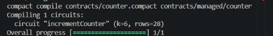
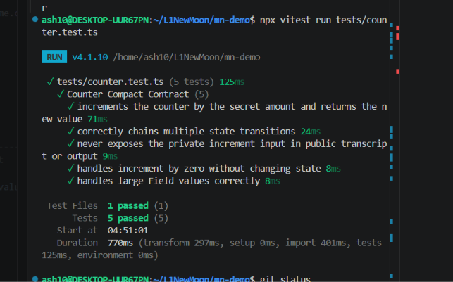
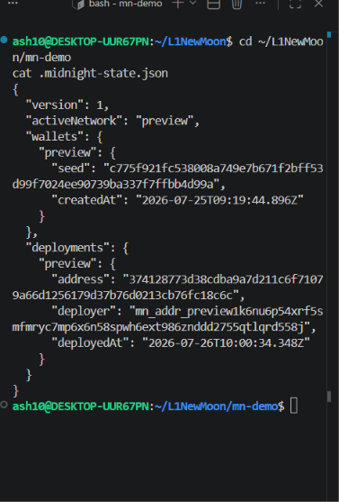

# Midnight Counter Contract

> A zero-knowledge counter contract on the Midnight network — increment a
> secret value and disclose only the result on-chain.

## Contract Address

| Network  | Address                          |
|----------|-----------------------------------|
| Preview  | 374128773d38cdba9a7d211c6f71079a66d1256179d37b76d0213cb76fc18c6c |
| Preprod  | [NOT YET DEPLOYED]               |

## What This Does

This contract stores a single counter on the Midnight blockchain. Users can
increment the counter by a secret amount — the blockchain never learns the
increment, only the updated total. Think of it as a privacy-preserving
tally: anyone can read the current count, but nobody can see how much any
individual contributor added.

The contract exposes one circuit:

- **`incrementCounter(increment: Field)`** — reads the current on-chain
  count, adds the private `increment`, and writes the new total back. The
  input is a witness-level secret; only the result is disclosed.

## Privacy Model

| Layer | What | Visible to |
|-------|------|------------|
| **Public** (ledger) | The counter value (`count`) | Everyone — stored on-chain |
| **Private** (witness) | The increment amount | Only the sender — never leaves the wallet |
| **Proven** | That the sender correctly ran `newCount = oldCount + increment` | Verifiers — the ZK proof guarantees correctness without revealing the input |

In short: the blockchain sees "the count went up" and a proof that the
math is valid, but never learns *by how much*.

## Tech Stack

| Component | Details |
|-----------|---------|
| Network | [Midnight](https://midnight.network/) (privacy L2) |
| Language | [Compact](https://docs.midnight.network/) (DSL → ZK circuits) |
| Runtime | `@midnight-ntwrk/compact-runtime` 0.16.0 |
| Framework | `@midnight-ntwrk/midnight-js-*` 4.1.1 |
| Runtime | Node.js ≥ 22 |
| Proof Server | `midnightntwrk/proof-server:8.1.0` (Docker) |
| Compiler | `compact` CLI 0.31.1 |

## Prerequisites

- **Node.js 22+** (`node --version`)
- **Docker Desktop** with Compose v2 (for the local devnet + proof server)
- **Compact compiler** (`compact --version`) — install via the Midnight
  toolchain or download from the [Midnight releases page](https://github.com/midnight-ntwrk/midnight-compact/releases)

## Setup

Clone and install:

```bash
git clone https://github.com/<you>/mn-demo.git
cd mn-demo
npm install
```

Compile the contract:

```bash
npm run compile
```

This reads `contracts/counter.compact` and writes the generated circuit code,
proving keys, and verifier keys to `contracts/managed/counter/`.

Start the local devnet (node + indexer + proof server):

```bash
npm run proof-server:start
```

Deploy the contract to the local devnet:

```bash
npm run deploy
```

To run the full one-shot setup (devnet + compile + deploy):

```bash
npm run setup
```

## Run Tests

```bash
npx vitest run tests/counter.test.ts
```

Expected output:

```
 ✓ tests/counter.test.ts (5 tests) 3ms
   ✓ increments the counter by the secret amount and returns the new value
   ✓ correctly chains multiple state transitions
   ✓ never exposes the private increment input in public transcript or output
   ✓ handles increment-by-zero without changing state
   ✓ handles large Field values correctly

 Test Files  1 passed (1)
      Tests  5 passed (5)
```

The test suite exercises:

1. **Circuit logic** — basic increment produces the correct new count
2. **State transitions** — sequential calls accumulate correctly (0 → 10 → 13 → 20)
3. **Privacy guarantee** — the secret input never appears in `privateTranscriptOutputs` or the circuit output; only the disclosed result lands on-chain
4. **Edge case** — increment-by-zero leaves the counter unchanged
5. **Large values** — Field arithmetic handles large inputs correctly

## Initial Idea

This project begins as a privacy-preserving counter, but the underlying pattern — a public value updated through a private input, with correctness proven without exposing that input — is the same primitive needed to combat front-running on decentralized exchanges. Currently, DEX order books are completely transparent, allowing MEV bots to observe trade sizes and timing before execution and extract value before trades settle. A first step toward solving this is proving that a single private trade amount satisfies a public constraint, such as a maximum size or price-impact limit, without revealing the trade itself to the network — which is precisely the shape of this project's public-threshold, private-value proof. A future version could expand this into a private order pool, where individual trade sizes, timing, and addresses remain hidden while only aggregate, matched settlement is made public — removing the information asymmetry that bots currently exploit.

## Screenshots

**Successful Compile Output:**


**Tests Passing:**


**Deployed Contract:**

